# GIT LAB GUIDE PROJECT


This guide will walk you through the fundamental concepts and main functionalities of Git and GitHub.


## Introduction to Version Control

### Overview of version control systems
Version control systems (VCS) are essential tools in software development and other collaborative projects. They help manage changes to source code over time, allowing multiple people to work on a project simultaneously without conflicts. Here's an overview of the key concepts and types of version control systems:

### Key Concepts

1. **Repository (Repo):**
   - A storage location for your project files and their history.
   - Can be local (on your computer) or remote (on a server).

2. **Commit:**
   - A snapshot of your project at a specific point in time.
   - Includes a message describing the changes made.

3. **Branch:**
   - A separate line of development.
   - Allows you to work on different features or fixes independently.

4. **Merge:**
   - Combining changes from different branches.
   - Resolves conflicts that arise when changes overlap.

5. **Clone:**
   - Creating a copy of a repository.
   - Allows you to work on a project locally.

6. **Pull/Push:**
   - Pull: Fetching changes from a remote repository to your local one.
   - Push: Sending your local changes to a remote repository.

### Types of Version Control Systems

1. **Local Version Control Systems:**
   - Store changes on your local machine.
   - Simple but limited to single-user scenarios.
   - Example: RCS (Revision Control System).

2. **Centralized Version Control Systems (CVCS):**
   - Use a central server to store all versions of a project.
   - Users check out files and commit changes to the central server.
   - Example: SVN (Subversion), CVS (Concurrent Versions System).

3. **Distributed Version Control Systems (DVCS):**
   - Each user has a complete copy of the repository.
   - Changes can be shared between repositories without a central server.
   - Example: Git, Mercurial.

### Popular Version Control Systems

1. **Git:**
   - Widely used DVCS.
   - Supports branching, merging, and distributed workflows.
   - Example platforms: GitHub, GitLab, Bitbucket.

2. **Subversion (SVN):**
   - Popular CVCS.
   - Centralized model with strong support for large binary files.

3. **Mercurial:**
   - Another DVCS.
   - Similar to Git but with a different approach to branching and merging.

### Benefits of Using Version Control Systems

- **Collaboration:** Multiple people can work on the same project simultaneously.
- **History:** Track changes and revert to previous versions if needed.
- **Backup:** Protect your code from data loss.
- **Branching and Merging:** Work on new features without affecting the main codebase.
- **Code Review:** Facilitate peer reviews and improve code quality.

### Example Workflow with Git

1. **Clone a Repository:**
   ```sh
   git clone https://github.com/username/repo.git
   ```

2. **Create a Branch:**
   ```sh
   git checkout -b new-feature
   ```

3. **Make Changes and Commit:**
   ```sh
   git add .
   git commit -m "Add new feature"
   ```

4. **Push Changes to Remote:**
   ```sh
   git push origin new-feature
   ```

5. **Merge Branch into Main:**
   ```sh
   git checkout main
   git merge new-feature
   ```

Version control systems are fundamental to modern software development, enabling efficient collaboration and robust project management. If you have any specific questions or need further details, feel free to ask!

### Benefits of using Git and GitHub
Using Git and GitHub offers numerous benefits, especially for developers and teams working on software projects. Here are some key advantages:

### Benefits of Using Git

1. **Distributed Version Control:**
   - Every developer has a complete copy of the repository, including its history.
   - Enables offline work and reduces dependency on a central server.

2. **Branching and Merging:**
   - Easy to create branches for new features, bug fixes, or experiments.
   - Merging branches is straightforward, allowing for parallel development.

3. **Speed and Performance:**
   - Git is designed to handle large projects efficiently.
   - Operations like commits, diffs, and merges are fast.

4. **Data Integrity:**
   - Git uses SHA-1 hashing to ensure the integrity of your data.
   - Every change is tracked and can be verified.

5. **Flexibility:**
   - Supports various workflows (e.g., centralized, feature branching, Gitflow).
   - Adaptable to different project needs and team structures.

### Benefits of Using GitHub
1. **Collaboration:**
   - GitHub provides tools for code review, issue tracking, and project management.
   - Facilitates collaboration through pull requests and discussions.

2. **Hosting and Backup:**
   - GitHub hosts your repositories in the cloud, providing backup and accessibility.
   - Ensures your code is safe and accessible from anywhere.

3. **Community and Open Source:**
   - GitHub is home to millions of open-source projects.
   - Easy to contribute to and learn from other projects.

4. **Integration and Automation:**
   - Integrates with various CI/CD tools, project management systems, and other services.
   - Automate workflows with GitHub Actions for continuous integration and deployment.

5. **Documentation and Wikis:**
   - Host project documentation and wikis directly within your repository.
   - Keep all project-related information in one place.

6. **Security Features:**
   - Provides security alerts for vulnerabilities in dependencies.
   - Supports two-factor authentication (2FA) and other security measures.

### Example Workflow with Git and GitHub

1. **Clone a Repository:**
   ```sh
   git clone https://github.com/username/repo.git
   ```

2. **Create a Branch:**
   ```sh
   git checkout -b new-feature
   ```

3. **Make Changes and Commit:**
   ```sh
   git add .
   git commit -m "Add new feature"
   ```

4. **Push Changes to GitHub:**
   ```sh
   git push origin new-feature
   ```

5. **Create a Pull Request on GitHub:**
   - Navigate to your repository on GitHub.
   - Click on **New pull request** and select your branch.
   - Add a description and submit the pull request for review.

6. **Merge Pull Request:**
   - Once reviewed and approved, merge the pull request into the main branch.

Using Git and GitHub together enhances your development workflow, making it more efficient, collaborative, and secure. 

<br>


## Setting Up Git
*Prerequisites: Git installed on local machine and GitHub account, Command Line Interface (Git Bash).*

### Installing and configuring Git
Verify git installation in terminalwith the command: `git -v`

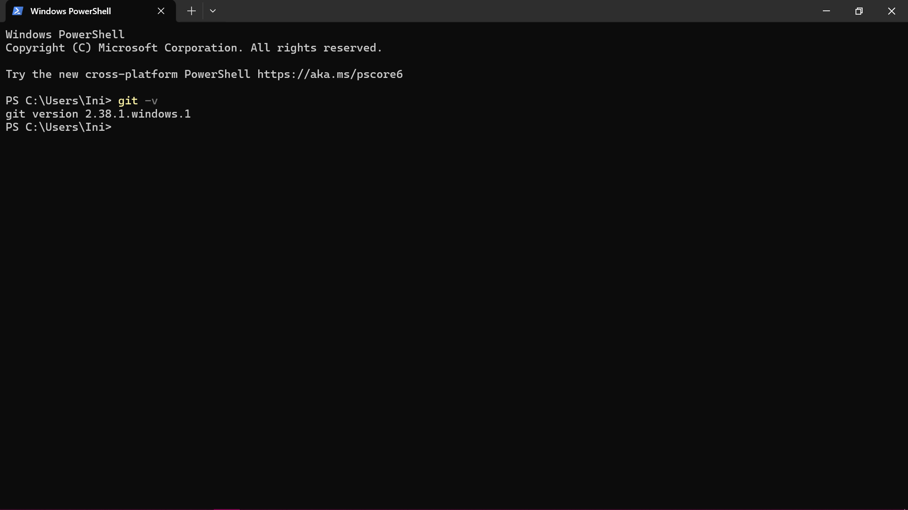

<br>

## Creating and Managing Repositories
### Initializing a Git repo
Initialized a Repository by opening a terminal and navigating to the directory where I want to create a new Git repository. Then, ran the `git init` command.

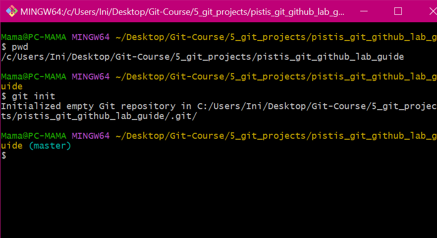

### Basic Git commands (add, commit, status, log)
Added and committed changes by creating a new file (e.g. README.md) in the repository and adding  content to it. Then, ran the following commands: 
```markdown
git add .
git commit -m ‘Initial commit’
git status
git log
```
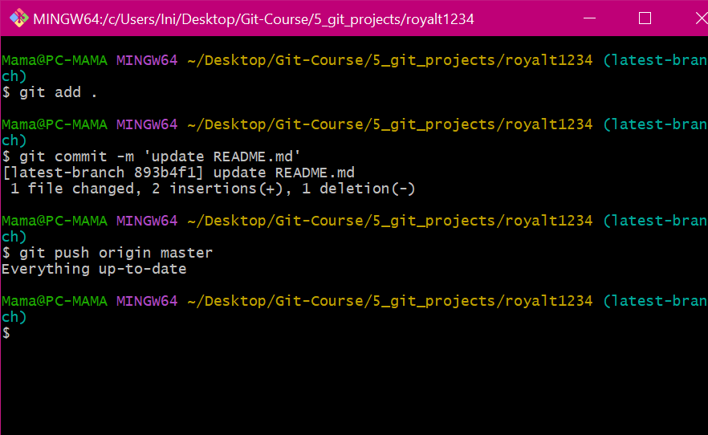

<br>

## Branching and Merging
### Creating and switching branches

Created a new branch named feature-branch and switched to it:
```markdown
git branch feature-branch
git checkout feature-branch
```
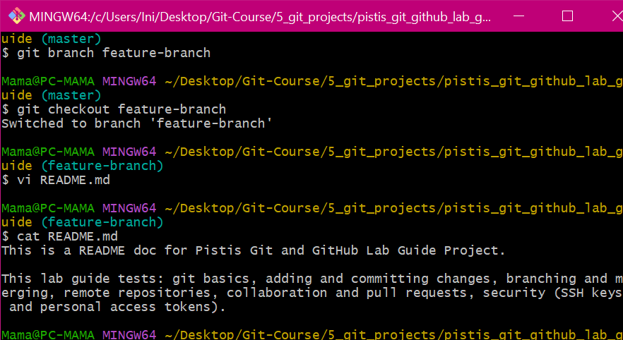

Made changes to the new branch i.e. feature-branch by editing the README.md file in it and committing the changes:
```markdown
git add .
git commit -m ‘Add feature in feature-branch’
```

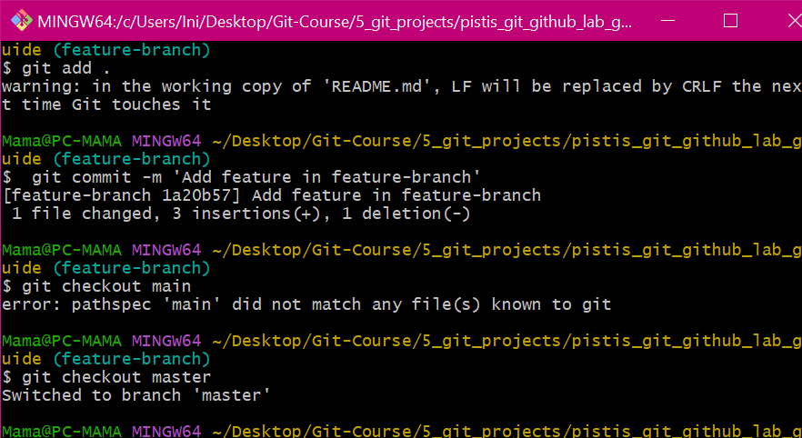

### Merging changes
Merged branches by switching back to the main branch and merging the changes from feature-branch into main branch:
```markdown
git checkout master
git merge feature-branch
```

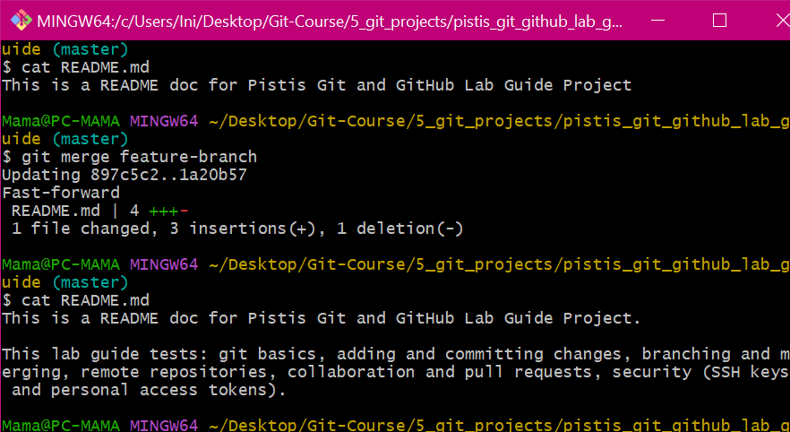

<br>

## Collaborating with GitHub
### Creating a GitHub repository
Remote Repositories:
Connected to a remote repository (e.g. in my GitHub account) by creating a new repository on GitHub. Then, linked my local repository to the remote repository:
```markdown
git remote add origin <repo-url>
git branch -M main
git push -u origin main
```
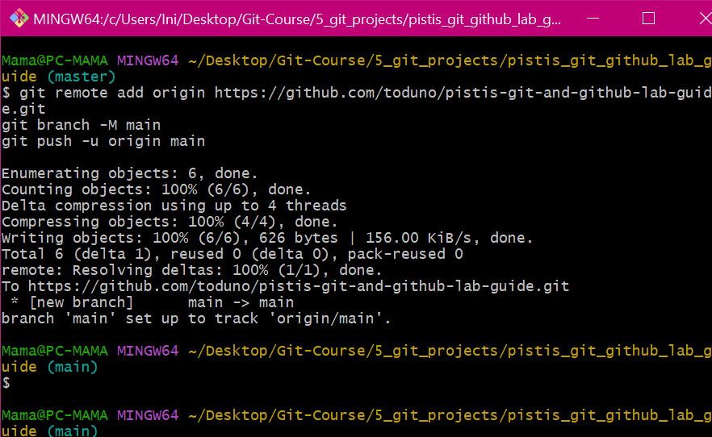

### Pushing and pulling changes
```markdown
git pull origin main
git push origin main
```
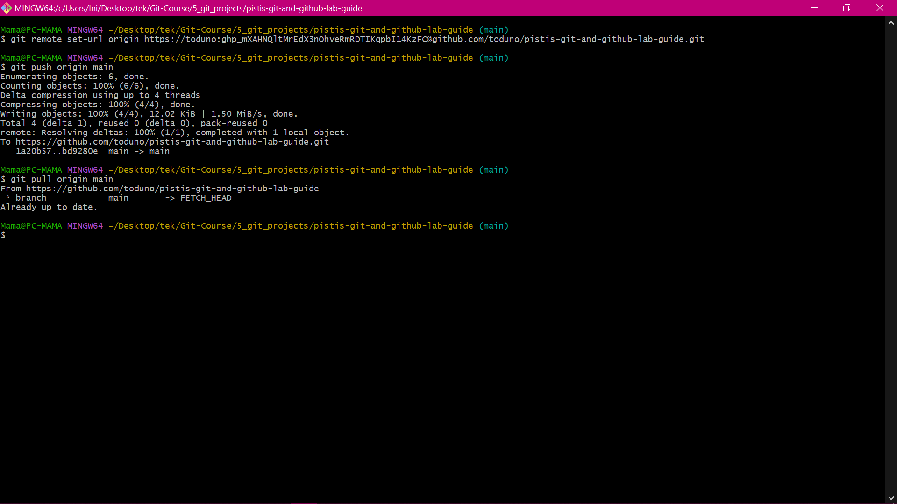

### Managing pull requests
1. Forked a repository on GitHub.
2. Created a pull request by cloning the forked repository, creating a new branch from it and making changes, and then pushing it to the forked repository. Finally, opened a pull request on GitHub for the forked repository:
```markdown
git clone <repo-url>
git branch latest-branch
git add . 
git commit -m ‘update README.md’
git push –set-upstream
```

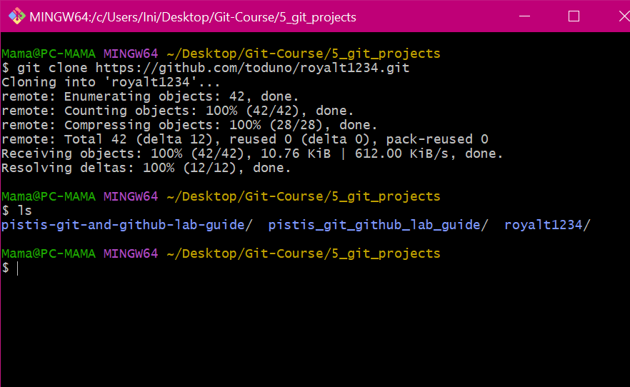
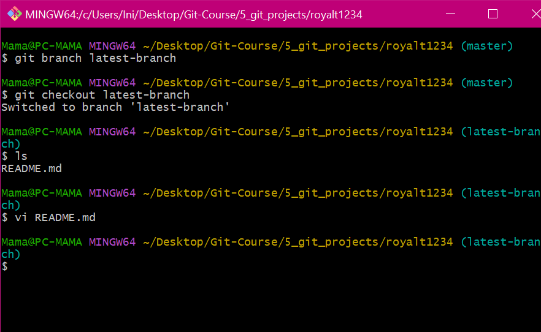

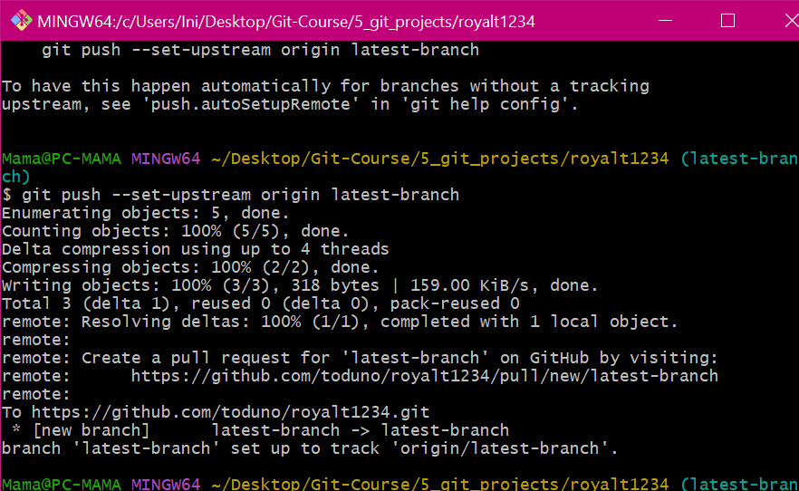
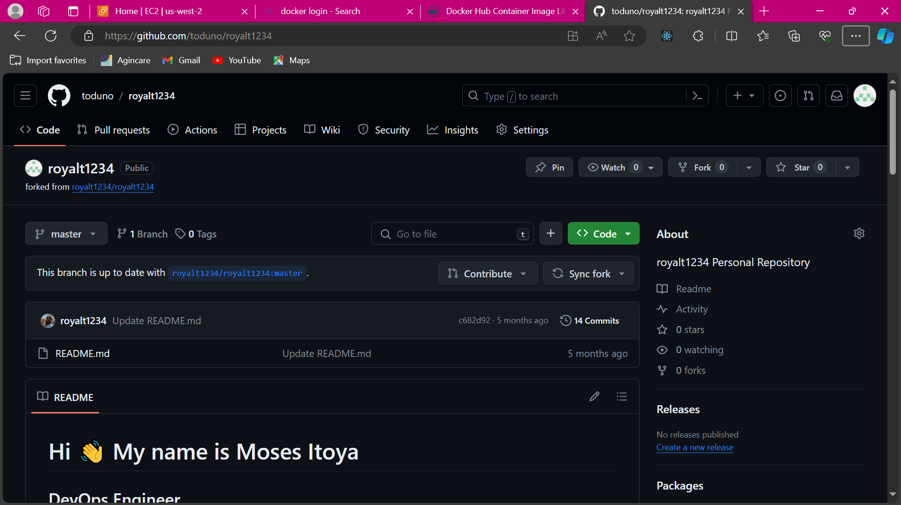
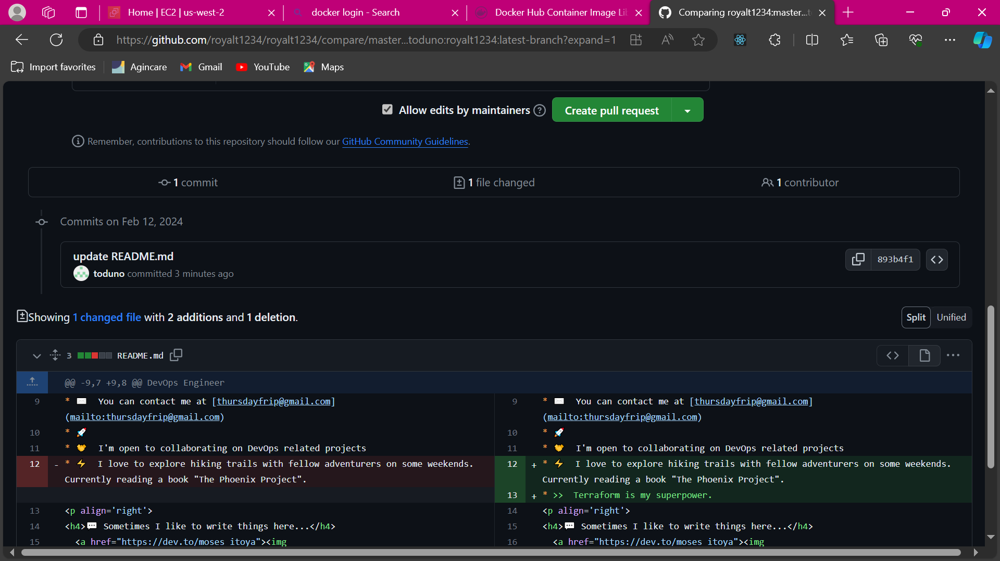
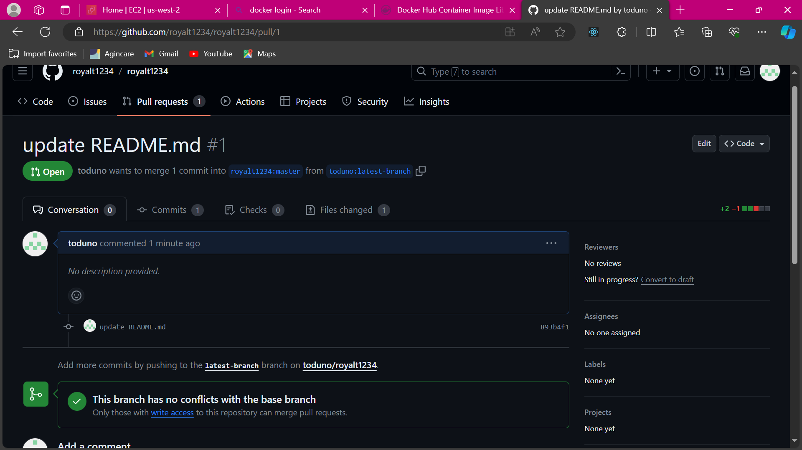
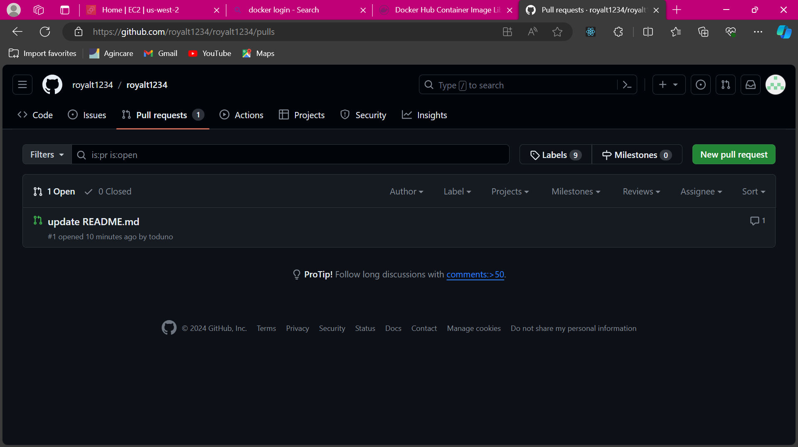


